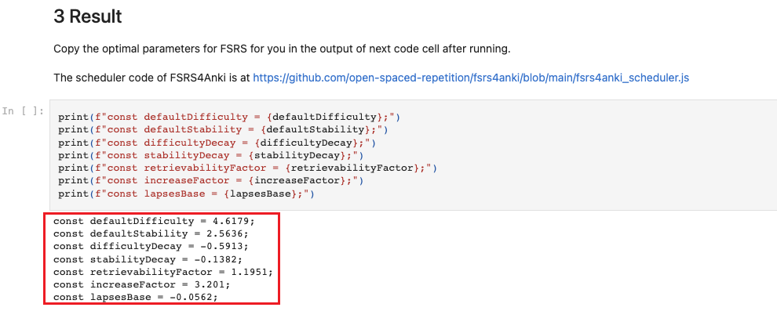
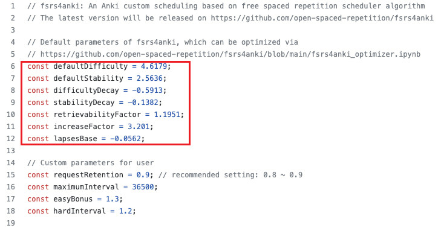

# FSRS4Anki

FSRS4Anki is an Anki [custom scheduling](https://faqs.ankiweb.net/the-2021-scheduler.html#add-ons-and-custom-scheduling) implementing the [Free Spaced Repetition Scheduler algorithm](https://github.com/open-spaced-repetition/free-spaced-repetition-scheduler). FSRS4Anki consists of two parts: scheduler and optimizer.

The scheduler is based on a variant of the DSR (Difficulty, Stability, Retrievability) model, which is used to predict memory states. The scheduler aims to achieve the requested retention for each card and each review.

The optimizer applies *Maximum Likelihood Estimation* and *Backpropagation Through Time* to estimate the stability of memory and learn the laws of memory from time-series review logs.

For more detail on the mechanism of the FSRS algorithm, please see the paper: [A Stochastic Shortest Path Algorithm for Optimizing Spaced Repetition Scheduling | Proceedings of the 28th ACM SIGKDD Conference on Knowledge Discovery and Data Mining](https://www.maimemo.com/paper/).

## Usage

### Scheduler

Please copy the code in [fsrs4anki_scheduler.js](fsrs4anki_scheduler.js), paste it into the bottom of the deck options screen (need to enable the scheduler v3 in Preferences), and save the options. Then it starts to work.

> Remember to use the dev version of Anki because the customData feature was implemented in Anki 2.1.55, which has not been released yet.

### Optimizer

The default parameters of FSRS4Anki are trained from my review logs. If you want the algorithm more adaptive to yourself, please follow the guide in [fsrs4anki_optimizer.ipynb](fsrs4anki_optimizer.ipynb) to optimize the parameters from your review logs. Because the neural network model is hard to port to various platforms, I deploy the optimizer on Google Colab. You need to click the button `Open in Colab` to run it.

Upload your deck file or collection file, and run the notebook. Then you will get the optimal parameters for yourself in the Result. Just replace the default parameters with the output of the optimizer.

> The default output is generated from my revlog. So they have no difference.

**For developer**: You can run it in a jupyter notebook locally. The dependencies are recorded in [requirements.txt](requirements.txt).

### Simulator

I develop a simple simulator in [fsrs4anki_simulator.ipynb](fsrs4anki_simulator.ipynb). You can use it to predict the review tasks scheduled by FSRS4Anki scheduler. It could be more accurate if you input the parameters generated by FSRS4Anki optimizer from your review logs. It is still in early stage, assuming that learner only rates `good` and `again`. I will improve it in the future.

## Compatibility

Some add-ons intervene in the scheduling of Anki, which would cause conflict with fsrs4anki. I will test these add-ons. Let me know via issues if I miss any add-ons.

| Add-on                                                       | Is it compatible? | Comment |
| ------------------------------------------------------------ |-------------------| ------- |
| [Auto Ease Factor](https://ankiweb.net/shared/info/1672712021) | in test     |         |
| [Delay siblings](https://ankiweb.net/shared/info/1369579727) | in test           |         |

## FAQ

see: [FAQ](https://github.com/open-spaced-repetition/fsrs4anki/wiki/FAQ)
